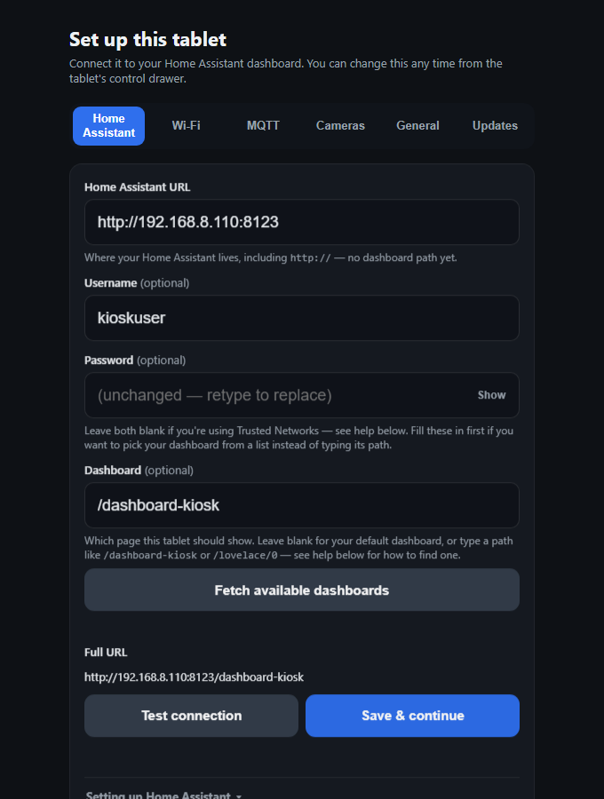
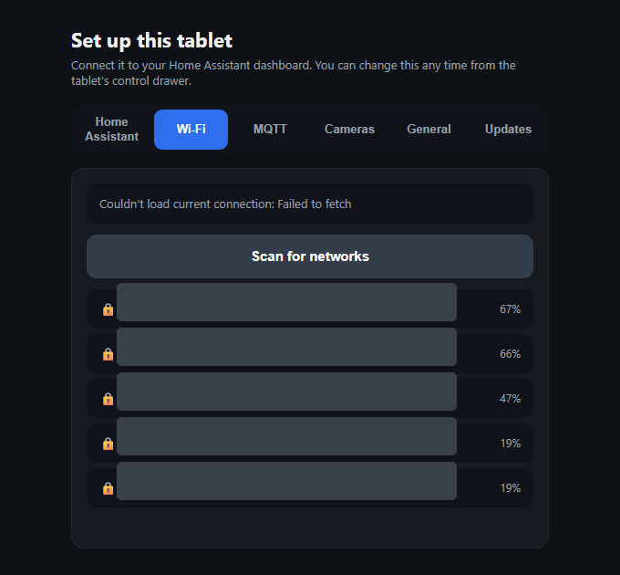
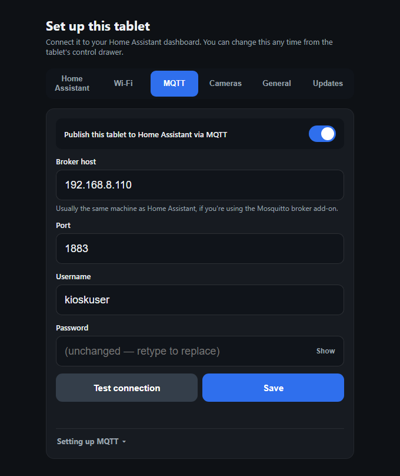
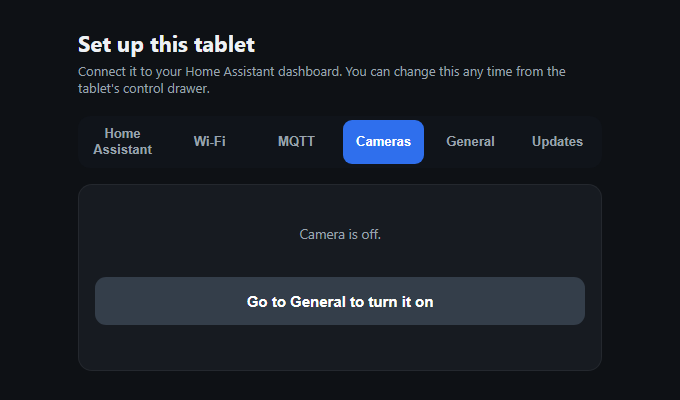
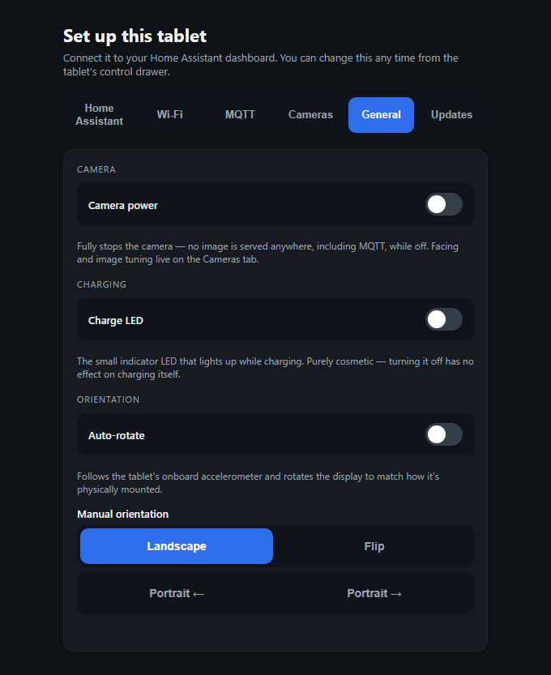
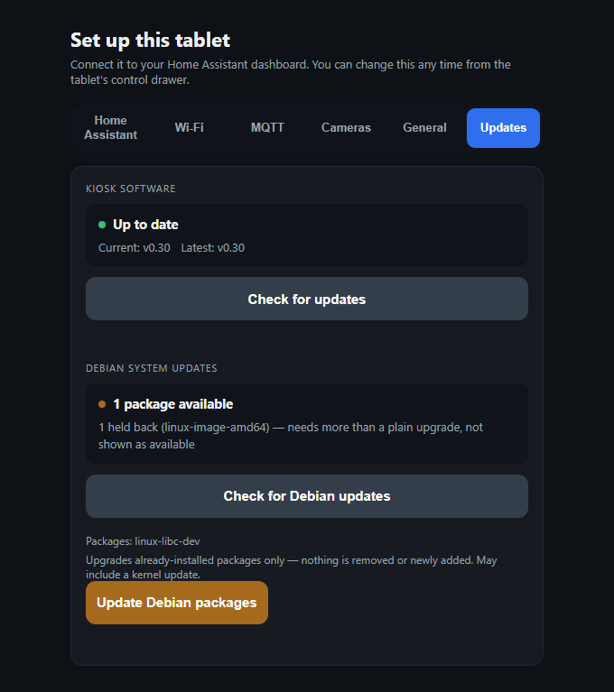
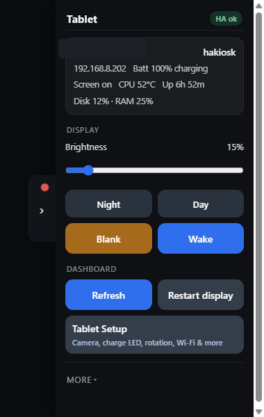

# Linx 12X64 → Home Assistant Linux Kiosk

Turn a wiped **Linx 12X64** (Atom x5-Z8350, 4GB) into a dedicated Home Assistant wall panel on Debian.

> **Transparency note:** Claude (Anthropic's AI) had a significant hand in developing this project — code, scripts, and docs alike. Every change was directed, reviewed, and extensively tested on real hardware by the maintainer; nothing here shipped unverified.

## What the tablet does

- **Full-screen Home Assistant dashboard** — Chromium in kiosk mode under `cage`, autologin, no desktop environment involved.
- **On-tablet setup wizard** — configure the Home Assistant URL/login, Wi-Fi, MQTT, and cameras, either on first boot or any time after via the control drawer.
- **On-screen control drawer** — brightness, day/night presets, blank/wake the screen, refresh or restart the dashboard, and jump back into setup, all without a keyboard or SSH.
- **Auto-rotation** from the onboard accelerometer, or manual landscape/portrait/flip.
- **Wake-on-touch** — any touch undoes an intentional screen blank.
- **HDMI mirroring** — mirrors any connected HDMI output onto the tablet's own panel.
- **MQTT device bridge** — publishes the tablet into Home Assistant as a device (battery, Wi-Fi, CPU/SoC temperature, uptime, disk/memory, etc. as diagnostic sensors) and exposes controls back the other way (brightness, night mode, blank/wake, refresh, restart, clear cache), plus an optional periodic dashboard screenshot published as a camera entity.
- **Front/rear camera** *(alpha, power-hungry — recommended off)* — live preview, on/off toggle, and exposure/white-balance/contrast tuning from the setup screen.
- **Power and thermal safety** — clean shutdown at 1% battery, low-battery display dimming, thermal camera cutoff, an AXP288 charging-current fix so it doesn't slowly discharge overnight while "plugged in", and a charge-LED toggle.
- **Self-maintenance** — checks for and applies kiosk software and Debian package updates from the Updates tab, a self-test script, a shutdown watchdog, and a remote deploy tool for pushing code changes over SSH.

## What you need

1. USB stick (≥8GB) for the installer
3. A PC to prepare that stick
4. Your Home Assistant setup

## Quick install path

Follow [docs/INSTALL.md](docs/INSTALL.md)

## Stack

- Debian 13 (Trixie) netinst (minimal / no desktop) — 
- `cage` (single-app Wayland compositor)
- Chromium kiosk mode
- Autologin on TTY1

## Screenshots

Screenshots of the additional tablet software and UI controls are below.

| Home Assistant | Wi-Fi | MQTT |
|---|---|---|
|  |  |  |

| Cameras | General | Updates |
|---|---|---|
|  |  |  |

A right-edge drawer (injected by the Chromium extension into the kiosk page) gives on-screen access to brightness, day/night dimming, screen blank/wake, dashboard refresh, and a shortcut back into the setup wizard — no keyboard or SSH needed:

